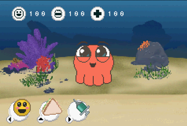

# Shubbo for GBA
Shubbo for GBA knowed also **Shubbo Advance** is a open demake project of the virtual pet's game Shubbo. This recreate the original game on the Gameboy Advance console.

## Third party libraries
- This project is developed with [Butano](https://github.com/GValiente/butano) Engine.
- You need [devkitARM](http://devkitpro.org/) toolchain for compile to GBA.

## Download ROM
Visit the [Itch.io](https://cnoaraul.itch.io/shubbo) page for get the latest ROM of Shubbo GBA.

## Contact and support
Join to our [Telegram Group](https://t.me/shubbo_for_gba)

## License
Shubbo for GBA is licensed under the GNU GPL 2.0, see the [LICENSE](LICENSE) file for details.
